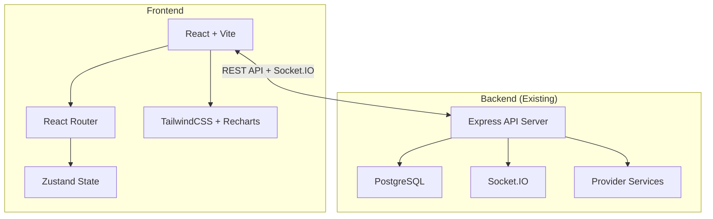
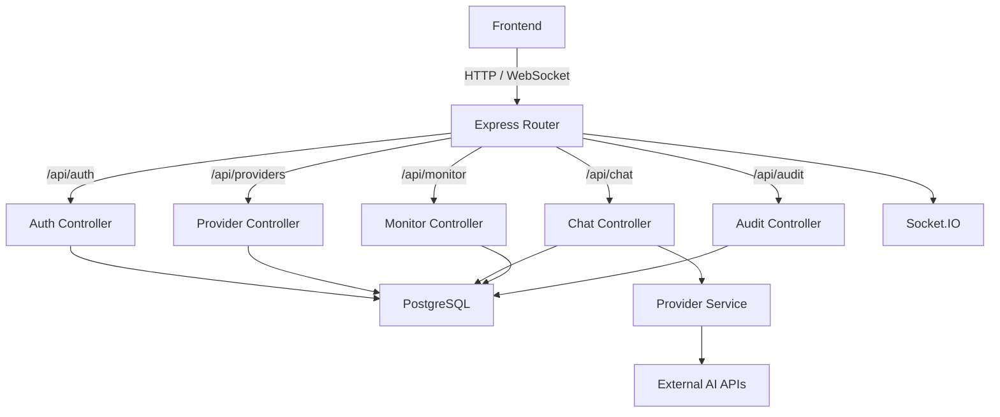

## 1. Architecture Design


## 2. Technology Description
- Frontend: React@18 + tailwindcss@3 + vite + TypeScript
- Initialization Tool: vite-init
- Backend: Express@4 (already exists)
- Database: PostgreSQL (already configured)
- Additional libraries: lucide-react, recharts, zustand, socket.io-client, clsx, twmerge

## 3. Route Definitions
| Route | Purpose |
|-------|---------|
| /login | User authentication page |
| / | Dashboard overview page |
| /settings | Providers and API keys management page |
| /monitor | Request monitoring and logs page |
| /audit | Audit logs page |

## 4. API Definitions
The backend already exists. Here's a summary of key endpoints used by frontend:

```typescript
// Auth
interface LoginRequest { email: string; password: string; }
interface LoginResponse { token: string; user: User; }
interface User { id: string; email: string; name?: string; }

// Providers
interface Provider {
    id: string;
    user_id: string;
    provider_name: string;
    provider_type: 'openai' | 'anthropic' | 'custom';
    api_key: string;
    base_url: string;
    enabled: boolean;
    last_success_at?: string;
    last_failed_at?: string;
    avg_latency?: number;
    created_at: string;
}

// API Keys
interface ApiKey {
    id: string;
    key_value: string;
    name: string;
    enabled: boolean;
    rate_limit: number;
    allowed_models?: string[];
    allowed_providers?: string[];
    ip_whitelist?: string[];
    created_at: string;
}

// Monitor
interface Request {
    id: string;
    provider: string;
    model: string;
    status_code: number;
    latency: number;
    prompt_tokens?: number;
    completion_tokens?: number;
    cost?: number;
    error_message?: string;
    created_at: string;
}

// Stats
interface DashboardStats {
    total_requests: number;
    today_requests: number;
    avg_latency_ms: number;
    success_rate: number;
    provider_stats: Array<{
        provider: string;
        count: number;
        avg_latency_ms: number;
    }>;
}

// Audit Logs
interface AuditLog {
    id: string;
    user_id: string;
    action: string;
    resource_type?: string;
    resource_id?: string;
    details?: any;
    ip_address?: string;
    created_at: string;
}
```

## 5. Server Architecture Diagram


## 6. Data Model
The backend database already exists. Key tables used by frontend:
- `users` - User accounts
- `providers` - AI provider configurations
- `api_keys` - Access keys
- `requests` - Request logs and metrics
- `audit_logs` - Audit trail
