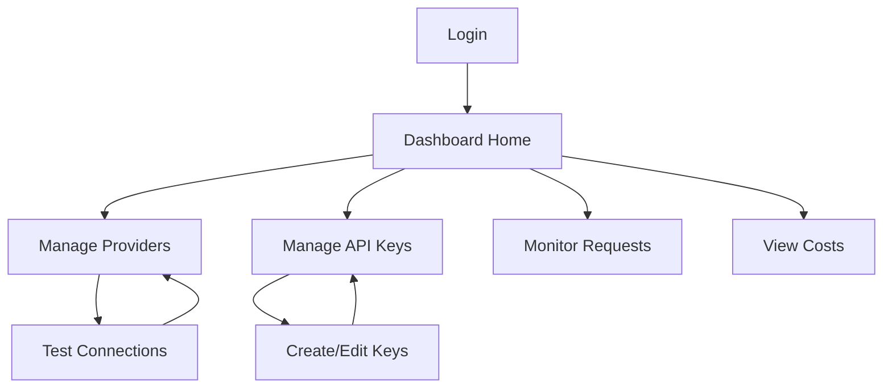

## 1. Product Overview
AI API Gateway Dashboard is a unified management interface for configuring, monitoring, and analyzing AI providers and API usage.
- Manage AI provider configurations, API keys, and monitor real-time metrics including costs, latency, and success rates
- Targets developers and businesses needing a single interface to manage multiple AI providers

## 2. Core Features

### 2.1 User Roles
| Role | Registration Method | Core Permissions |
|------|---------------------|------------------|
| User | Email registration | Full access to all dashboard features |

### 2.2 Feature Module
1. **Login page**: user authentication
2. **Dashboard home**: overview statistics and real-time metrics
3. **Providers page**: manage AI provider configurations, test connections
4. **API Keys page**: create and manage access keys
5. **Monitor page**: view detailed request logs and analytics
6. **Cost page**: usage billing and cost management

### 2.3 Page Details
| Page Name | Module Name | Feature description |
|-----------|-------------|---------------------|
| Login page | Auth form | Email/password login, registration link |
| Dashboard home | Stats overview | Total requests, today's usage, monthly cost, success rate |
| Dashboard home | Real-time chart | Hourly requests in last 24h, with success/failure |
| Dashboard home | Provider stats | Quick view of each provider's performance |
| Providers page | Provider list | Display all configured providers in a table |
| Providers page | Add provider | Modal form for adding new providers (type, name, API key, base URL) |
| Providers page | Test connection | Button to test provider connectivity |
| Providers page | Get models | Retrieve available models for a provider |
| API Keys page | Key list | Display all API keys with status, name, rate limit |
| API Keys page | Create key | Modal form to create new API keys with optional restrictions |
| API Keys page | Toggle/Delete | Enable/disable keys or delete them |
| Monitor page | Request list | Filterable, paginated table of requests with details |
| Monitor page | Model stats | Breakdown of requests by model |
| Cost page | Monthly bill | Detailed billing by model/provider |
| Cost page | Quota management | View and set usage limits |

## 3. Core Process
User logs in → navigates dashboard → manages providers/keys → monitors usage/metrics → manages costs

## 4. User Interface Design
### 4.1 Design Style
- Primary colors: Dark theme with slate-gray background (#0f172a), blue accents (#3b82f6)
- Button style: Rounded corners, subtle gradients, hover with glow effects
- Font: Space Grotesk for display, Inter for body text
- Layout style: Card-based with generous spacing, sidebar navigation
- Icon style: Lucide icons with consistent size and stroke

### 4.2 Page Design Overview
| Page Name | Module Name | UI Elements |
|-----------|-------------|-------------|
| Login page | Auth form | Glassmorphism card, centered layout, animated gradient background |
| Dashboard home | Stats overview | Colorful stat cards (4 in row), subtle shadows and micro-animations on hover |
| Dashboard home | Charts | Recharts line and bar charts with interactive tooltips |
| Providers page | Provider list | Data table with status badges, action buttons per row |
| Providers page | Modal | Centered, dark-themed modal with clean form layout |
| Monitor page | Request list | Table with status code badges, latency, cost, and timestamps |
| Cost page | Bill details | Detailed breakdown with currency formatting, visual progress bars for quotas |

### 4.3 Responsiveness
Desktop-first design with responsive breakpoints at 640px, 768px, 1024px, and 1280px. Touch-friendly interface with larger tap targets for mobile devices.
