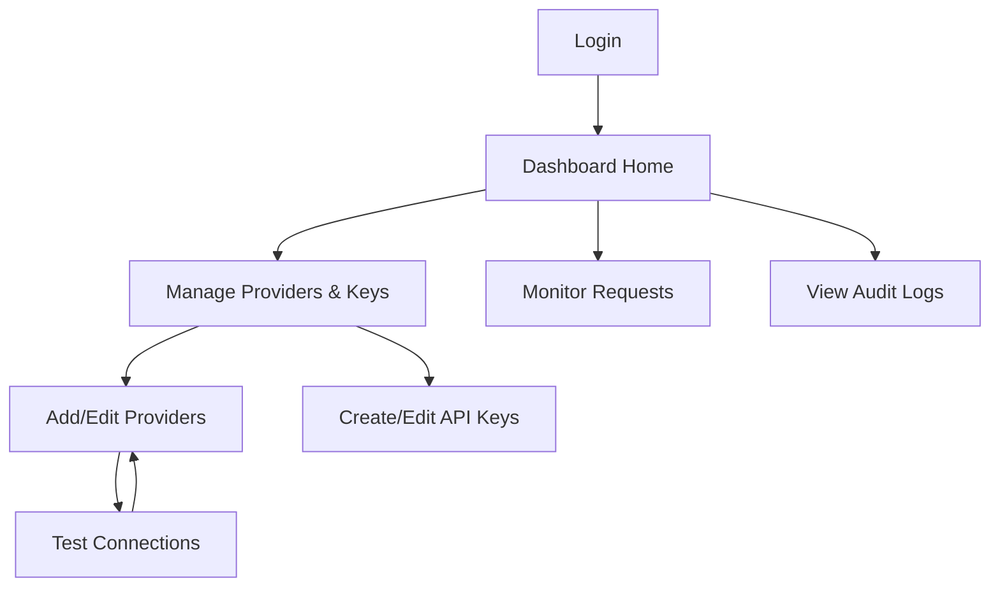

## 1. Product Overview
AI API Gateway Dashboard is a unified management interface for configuring, monitoring, and analyzing AI providers and API usage.
- Manage AI provider configurations, API keys, and monitor real-time metrics including latency and success rates
- Targets developers and businesses needing a single interface to manage multiple AI providers

## 2. Core Features

### 2.1 User Roles
| Role | Registration Method | Core Permissions |
|------|---------------------|------------------|
| User | Email registration | Full access to all dashboard features |

### 2.2 Feature Module
1. **Login page**: user authentication
2. **Dashboard home**: overview statistics and real-time metrics
3. **Providers & Keys page**: manage AI providers and API keys in one place
4. **Monitor page**: view detailed request logs and analytics
5. **Audit Logs page**: view user operation audit trail

### 2.3 Page Details
| Page Name | Module Name | Feature description |
|-----------|-------------|---------------------|
| Login page | Auth form | Email/password login, registration link |
| Dashboard home | Stats overview | Total requests, today's usage, avg latency, success rate |
| Dashboard home | Real-time chart | Hourly requests in last 24h, with success/failure |
| Dashboard home | Provider stats | Quick view of each provider's performance |
| Providers & Keys page | Tabs view | Split into two tabs: "Providers" and "API Keys" |
| Providers & Keys page | Provider list | Display all configured providers in a clean table |
| Providers & Keys page | Add provider | Modal form for adding new providers (type, name, API key, base URL) |
| Providers & Keys page | Test connection | Button to test provider connectivity |
| Providers & Keys page | Get models | Retrieve available models for a provider |
| Providers & Keys page | API Key list | Display all API keys with status, name, rate limit |
| Providers & Keys page | Create key | Modal form to create new API keys with optional restrictions |
| Providers & Keys page | Toggle/Delete | Enable/disable keys or delete them |
| Monitor page | Request list | Filterable, paginated table of requests with details |
| Monitor page | Model stats | Breakdown of requests by model |
| Audit Logs page | Log list | Display all user operations with timestamps and details |
| Audit Logs page | Filter/search | Filter logs by action type, date range |

## 3. Core Process
User logs in → navigates dashboard → manages providers/keys → monitors usage/metrics → views audit logs

## 4. User Interface Design
### 4.1 Design Style
- Primary colors: Clean white/light gray background (#f5f5f7) with blue accents (#007aff)
- Button style: Minimalist, rounded corners (12px), subtle hover elevation
- Font: SF Pro Display/SF Pro Text system fonts, clear typographic hierarchy
- Layout style: Apple-style card design, generous white space, subtle soft shadows
- Icon style: SF Symbols-inspired, clean line art, consistent stroke weight

### 4.2 Page Design Overview
| Page Name | Module Name | UI Elements |
|-----------|-------------|-------------|
| Login page | Auth form | Centered glass-effect card, soft gradients, subtle motion on load |
| Dashboard home | Stats overview | Clean white stat cards with soft shadows, animated counters |
| Dashboard home | Charts | Minimalist Recharts with muted colors, clean tooltips |
| Providers page | Provider list | Clean table with subtle dividers, soft badge colors, smooth hover states |
| Providers page | Modal | Centered white sheet with subtle shadow, clean form inputs |
| Monitor page | Request list | Scannable table with clear status indicators, muted secondary information |
| Audit Logs page | Log list | Timeline-style view, clear action labels, timestamp hierarchy |

### 4.3 Responsiveness
Desktop-first design with responsive breakpoints at 640px, 768px, 1024px, and 1280px. Touch-friendly interface with larger tap targets and smooth transitions optimized for iOS/macOS experience.
